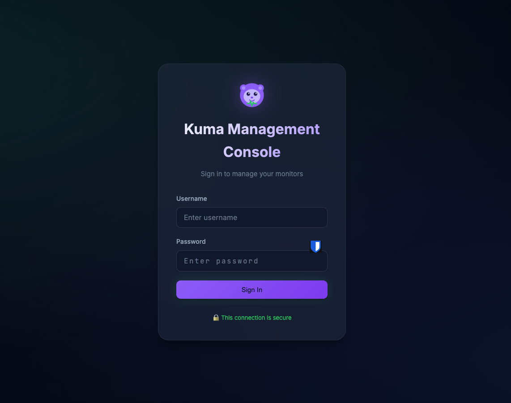
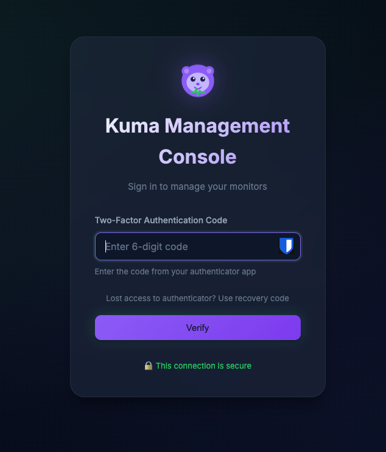
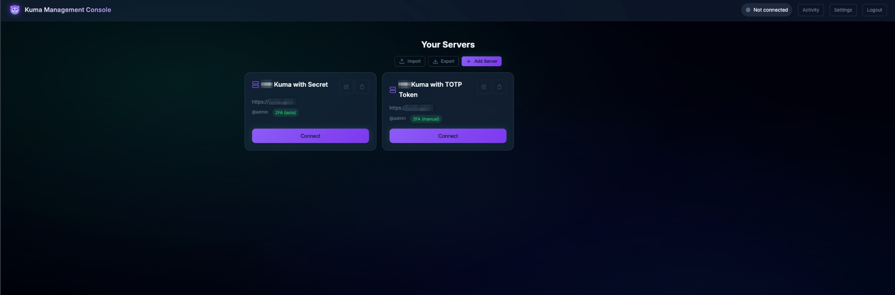
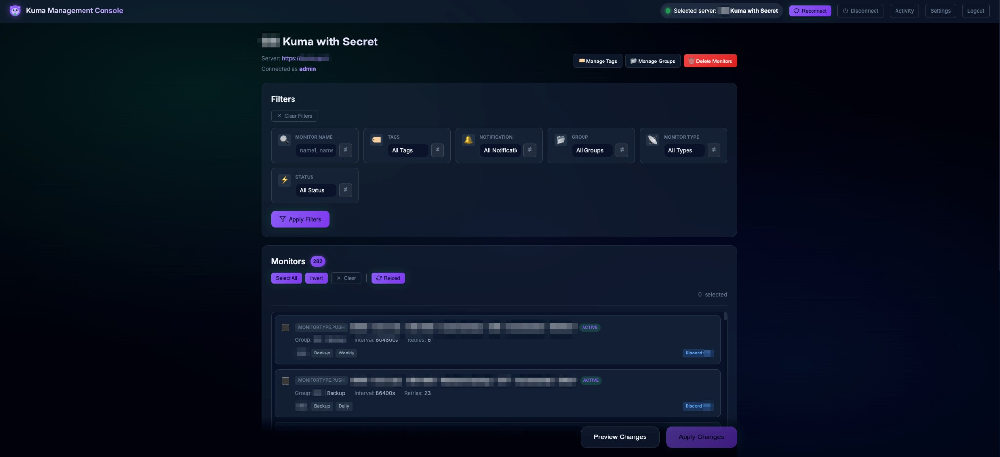
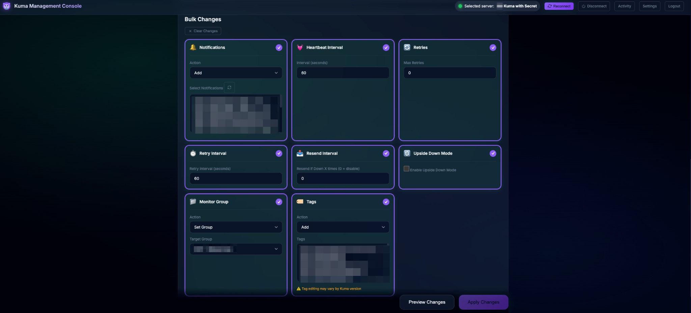
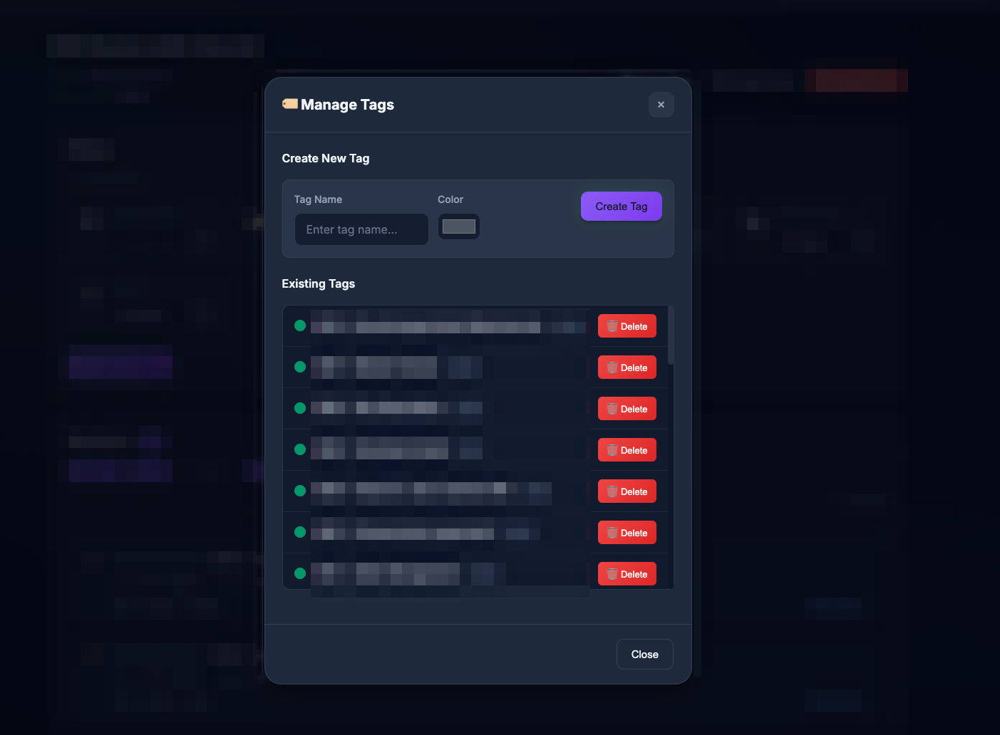
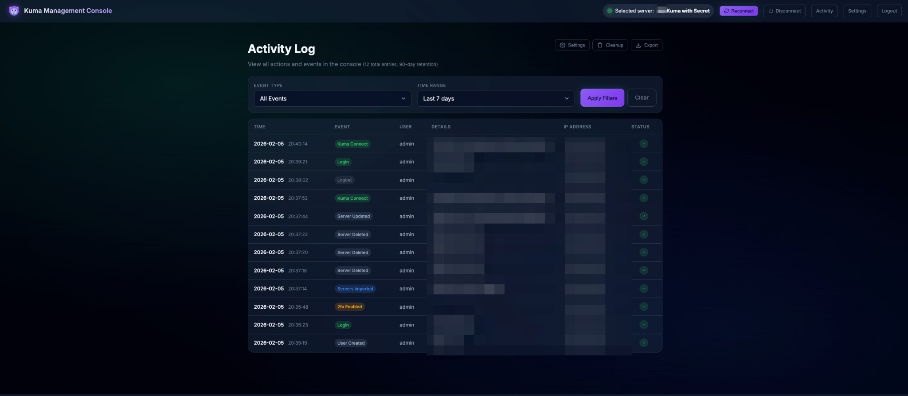

# Uptime Kuma Monitor Tools

This repository contains multiple applications and add-ons for Uptime Kuma, organized by role so setup is easier to understand.

## Stop here if you just want it running

If you only want the web UI running, do exactly this from the repository root:

```bash
cd main
cp -n .env.example .env
docker compose up -d --build
docker compose ps
```

Then open: `http://localhost:5080`

If `docker compose ps` shows `kuma-management-console` as `Up` (or `healthy`), you are done.

## Folder hierarchy

```text
.
├── main/                         # Main integration entry point (compose + env)
├── apps/
│   ├── kuma-management-console/  # Web UI application
│   ├── kuma-bulk-editor/         # CLI application
│   └── kuma-notifications-editor/# CLI application
├── addons/
│   ├── mount-monitor/            # Optional mount/filesystem monitor addon
│   └── unix-storage-monitor/     # Optional SMART + storage monitor addon
└── docs/                         # Shared screenshots/docs assets
```

## Start here

1. New here? Start with `main/README.md` and complete the web UI setup first.
2. If the web UI is already running, pick only one tool flow below.
3. Open only the README for the tool you want to use:
   - `apps/kuma-management-console/README.md` (web UI)
   - `apps/kuma-bulk-editor/README.md` (CLI bulk editor)
   - `apps/kuma-notifications-editor/README.md` (CLI notifications editor)
   - `addons/mount-monitor/README.md` (mount addon)
   - `addons/unix-storage-monitor/README.md` (Ubuntu/Unix SMART + storage addon)
   - `addons/README.md` (addon index + quick installer commands)

## Quick Addon Install

Install add-ons directly from GitHub raw links:

### Mount monitor addon

```bash
curl -sL https://raw.githubusercontent.com/gsiscotty/Uptime.Kuma.Monitor.Tools/main/addons/mount-monitor/install.sh | bash
```

### Unix storage/SMART addon

```bash
curl -sL https://raw.githubusercontent.com/gsiscotty/Uptime.Kuma.Monitor.Tools/main/addons/unix-storage-monitor/install.sh | bash
```

## Choose one path

### Path A: Web UI (recommended first)

Do this first unless you specifically want CLI-only usage:

- Use the commands in "Stop here if you just want it running"
- Then follow `main/README.md` for first-run details (secret key and troubleshooting)
- See UI preview screenshots in `apps/kuma-management-console/README.md`

### Path B: CLI scripts only (no web UI)

Use either:

- `apps/kuma-bulk-editor/README.md`
- `apps/kuma-notifications-editor/README.md`

### Path C: Mount monitor addon

Use:

- `addons/mount-monitor/README.md`

### Path D: Unix storage/SMART addon

Use:

- `addons/unix-storage-monitor/README.md`

## Web UI preview (what you will see)

Login and 2FA:

| Login | 2FA |
|---|---|
|  |  |

Saved servers:



Filtering and bulk changes:

| Filters | Bulk changes |
|---|---|
|  |  |

Tag and activity management:

| Manage tags | Activity log |
|---|---|
|  |  |
