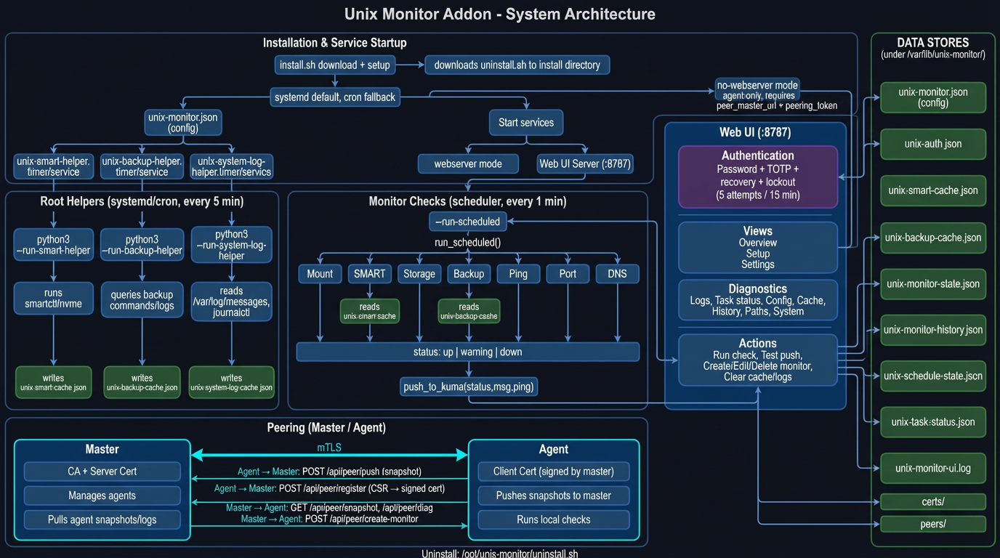

# Unix Monitor Addon - System Architecture



## 1. Installation & Runtime Startup

The Unix installer sets up one of two operating modes:

- **Webserver mode** (default): local UI + scheduler + helper timers
- **No-webserver mode**: agent-only menu mode (master connection required)

Installer responsibilities:

- downloads `unix-monitor.py`
- writes `unix-monitor.json`
- installs systemd units/timers by default
- supports cron fallback mode when selected

### Webserver / No-Webserver Branch

| Mode | Behavior |
|------|----------|
| **Webserver enabled** | Starts UI (`--ui`) and scheduled checks (`--run-scheduled`) with helper timers. |
| **Webserver disabled** | Enforces agent-only constraints: `peer_role=agent`, `peer_master_url` and `peering_token` are required. Local UI is blocked. |

### systemd Timers / Services (default path)

| Unit | Purpose | Entry Point |
|------|---------|-------------|
| `unix-monitor-ui.service` | Web UI process | `--ui` |
| `unix-monitor-scheduler.timer` + service | Scheduled monitor checks | `--run-scheduled` |
| `unix-monitor-smart-helper.timer` + service | SMART helper cache refresh | `--run-smart-helper` |
| `unix-monitor-backup-helper.timer` + service | Backup helper cache refresh | `--run-backup-helper` |
| `unix-monitor-system-log-helper.timer` + service | System-log helper cache refresh | `--run-system-log-helper` |

Notes:

- `unix-monitor-scheduler.service` is intentionally `Type=oneshot` (no long-running PID).
- Scheduler interval is installer-configurable (`cron_interval_minutes`), defaulting to 1 minute for systemd mode.

## 2. Root Helpers (5-minute cadence)

Three helper entry points collect privileged data for non-root checks:

- **SMART helper**: gathers SMART/NVMe state and writes SMART cache
- **Backup helper**: gathers backup/task signals and writes backup cache
- **System-log helper**: collects relevant system log excerpts

Cache age target is 20 minutes. Stale cache state can degrade monitor status to warning/down depending on mode.

## 3. Monitor Checks (scheduler execution)

`run_scheduled()` iterates configured monitors and executes by `check_mode`.

Scheduler execution behavior:

- logs `scheduled-run | start` and `scheduled-run | done` with due/attempted counters
- isolates monitor failures (one monitor error does not stop the whole pass)
- records per-monitor schedule timestamps even when push fails, so UI timing stays accurate

| Mode | Function | Behavior |
|------|----------|----------|
| **Mount** | `check_mounts_status()` | Reads mounts from `/proc/mounts`, validates mount accessibility and filesystem reachability. |
| **SMART** | `check_smart()` | Reads helper cache (or direct probe when allowed). |
| **Storage** | `check_storage()` | Tries platform-specific storage probes; falls back to generic Unix checks (`df`, `/proc/mdstat`) when needed. |
| **Backup** | `_probe_backup()` | Uses helper cache and backup/log fallbacks where platform tooling is unavailable. |
| **Ping** | `_probe_ping()` | ICMP ping with TCP fallback. |
| **Port** | `_probe_port()` | TCP connect probe with timeout. |
| **DNS** | `_probe_dns()` | `nslookup` or resolver-based fallback. |

Each check returns:

- status: `up`, `warning`, or `down`
- message lines
- latency in ms

### Push to Uptime Kuma

`push_to_kuma()` sends:

```
GET {base_url}?status={status}&msg={message}&ping={latency_ms}
```

`warning` is normalized for Kuma compatibility where needed, while warning details remain in `msg`.

Message source logic:

- local Unix monitors send `Unix check (...)`
- Synology-origin monitors (via peering metadata) keep `Synology check (...)`
- backup fallback guidance text is source-aware (Unix helper instructions vs DSM task scheduler wording)

## 4. Web UI Layer

The UI runs on `ThreadingHTTPServer` (default port `8787`), with optional TLS where cert material exists.

### Authentication

- password + TOTP 2FA
- short-lived challenge flow for 2FA
- session cookies with TTL
- recovery codes (one-time)
- lockout after repeated failures

### Views

| View | Description |
|------|-------------|
| **Overview** | Monitor cards, run/test actions, health summary |
| **Setup** | Guided monitor setup and operational controls |
| **Settings** | Role/peering/security configuration, maintenance actions |

### Diagnostics

Includes logs, task state, config snapshot, cache state, history, file-path/system info surfaces.

Automation diagnostics include backend-aware details:

- `systemd` mode shows timer state (`active/substate`), next/last trigger, and explains oneshot semantics
- `cron` mode shows process/PID style status and relevant crontab entries
- both modes expose active config/runtime paths to catch path-split issues quickly

## 5. Peering (Standalone / Master / Agent)

Roles:

- **Standalone**: no peering
- **Master**: aggregates agent snapshots, can create remote monitors
- **Agent**: runs local checks and pushes snapshots to master

Core endpoints:

- `GET /api/peer/health`
- `GET /api/peer/snapshot`
- `GET /api/peer/diag`
- `POST /api/peer/push`
- `POST /api/peer/register`
- `POST /api/peer/create-monitor`

Typical flow:

1. Agent configured with master URL + peering token.
2. Agent pushes snapshots after scheduled checks.
3. Master stores peer snapshots and can request/create remote monitors.

Snapshot metadata includes platform hints (`platform`, `platform_family`) so master-side behavior can preserve source-specific message wording.

## 6. Data Stores

Primary runtime directory preference is Unix-oriented:

1. `/var/lib/unix-monitor/`
2. script directory
3. `~/.config/unix-monitor/`

Main files:

| File | Purpose |
|------|---------|
| `unix-monitor.json` | Main configuration |
| `unix-auth.json` | Authentication state |
| `unix-smart-cache.json` | SMART helper cache |
| `unix-backup-cache.json` | Backup helper cache |
| `unix-system-log-cache.json` | System-log helper cache |
| `unix-monitor-state.json` | Current monitor states |
| `unix-monitor-history.json` | State history |
| `unix-schedule-state.json` | Scheduler timing state |
| `unix-task-status.json` | Task status and diagnostics |
| `unix-monitor-ui.log` | Append-only runtime/UI log |
| `certs/` | TLS/mTLS material (when configured) |
| `peers/` | Cached peer snapshot data |

## 7. CLI Entry Points

All via `python3 unix-monitor.py <flag>`:

| Flag | Purpose |
|------|---------|
| `--ui` | Start web UI server (`--host` / `--port` supported) |
| `--run-smart-helper` | Run SMART helper pass |
| `--run-backup-helper` | Run backup helper pass |
| `--run-system-log-helper` | Run system-log helper pass |
| `--run-scheduled` | Run one scheduled pass |
| `--run-scheduled-loop` | Continuous scheduled loop |
| `--run` / `-r` | Run checks once (interactive-disabled path) |
| `--agent-menu` | Force agent-only menu mode gate |
| `--help` / `-h` | Show CLI usage |
| *(none)* | Interactive menu |

## 8. Automation Repair Strategy

`Repair automation` is backend-aware:

- **systemd backend**: enables/starts unix-monitor timers/services via `systemctl` (no cron fallback injection)
- **cron backend**: installs deterministic cron entries using the active script path and configured interval
